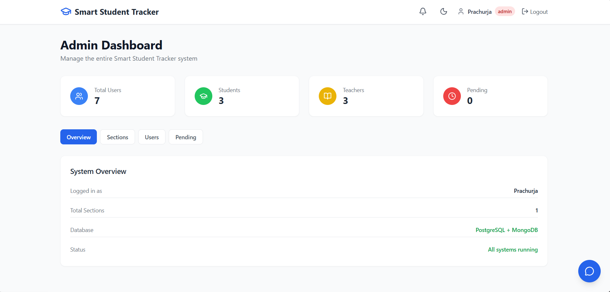
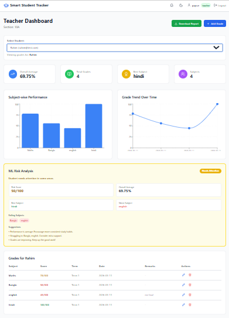
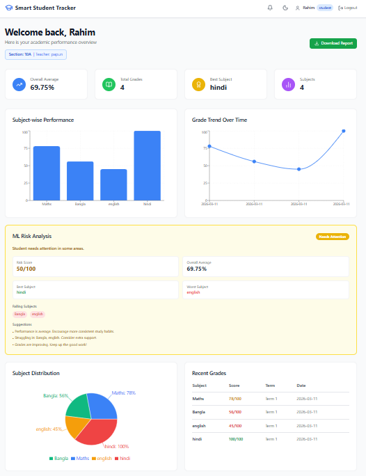
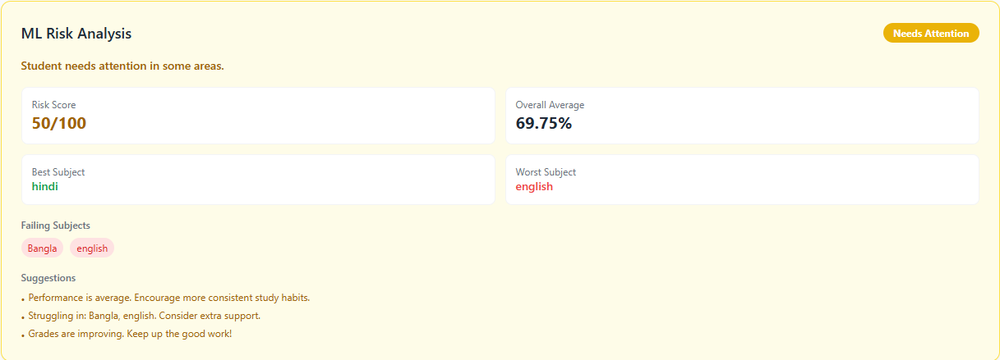
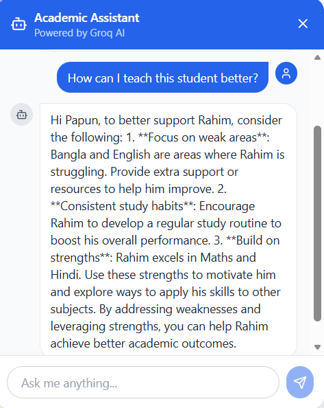
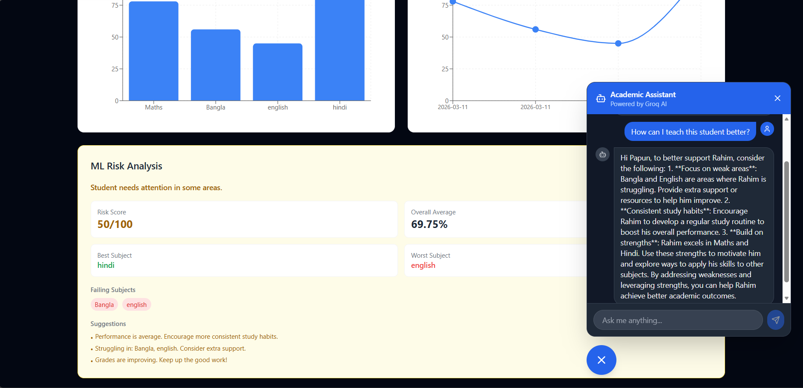

# 🎓 Smart Student Tracker

An AI-powered student performance analytics platform built as a full-stack portfolio project. Features real-time notifications, machine learning risk analysis, an AI chatbot, PDF report generation, and a fully responsive dark/light mode UI.

**Live Demo:** [smart-student-tracker-eight.vercel.app](https://smart-student-tracker-eight.vercel.app)

---

## Screenshots

### Admin Dashboard


### Teacher Dashboard


### Student Dashboard


### ML Risk Analysis


### AI Chatbot


### Dark Mode


---

## ✨ Features

### 👨‍🎓 Student
- View personal grade analytics with charts
- ML-powered academic risk assessment (Green / Yellow / Red)
- Real-time grade notifications via Socket.IO
- Persistent notifications stored in MongoDB
- AI chatbot for academic guidance
- Download PDF performance report
- Dark / Light mode
- Fully responsive on mobile

### 👨‍🏫 Teacher
- Manage grades for assigned students (Add / Edit / Delete)
- View student analytics and ML risk analysis
- Real-time updates when grades are modified
- AI chatbot for student insights
- Download student PDF reports
- Section-based student management

### 🛡️ Admin
- Approve or reject teacher registration requests
- Manage all users across the system
- Create sections and assign teachers and students
- Promote users to admin
- AI chatbot for system insights
- Full system overview dashboard

---

## 🛠️ Tech Stack

### Frontend
- React (Vite)
- TailwindCSS
- Recharts
- Socket.IO Client
- Axios
- React Router DOM
- jsPDF + jsPDF-AutoTable
- Lucide React

### Backend
- Node.js + Express
- Socket.IO
- JSON Web Tokens (JWT)
- Sequelize ORM (PostgreSQL)
- Mongoose (MongoDB)
- Groq SDK (llama-3.3-70b-versatile)
- Axios

### Databases
- PostgreSQL (Neon) - Users, Grades, Sections
- MongoDB Atlas - Notifications

### ML Service
- Python + Flask
- NumPy
- Scikit-learn
- Gunicorn

### Deployment
- Frontend: Vercel
- Backend: Render
- ML Service: Render
- PostgreSQL: Neon (Free Forever)
- MongoDB: MongoDB Atlas

---

## 🏗️ Architecture

```
smart-student-tracker/
├── frontend/          # React + Vite app
├── backend/           # Node.js + Express API
│   ├── config/        # PostgreSQL + MongoDB config
│   ├── controllers/   # Route controllers
│   ├── middleware/     # Auth middleware
│   ├── models/        # Sequelize + Mongoose models
│   └── routes/        # API routes
└── ml-service/        # Python Flask ML microservice
```

---

## 🚀 Getting Started

### Prerequisites
- Node.js v18+
- Python 3.10+
- PostgreSQL
- MongoDB Atlas account

### 1. Clone the repository
```bash
git clone https://github.com/prachurja99/smart-student-tracker.git
cd smart-student-tracker
```

### 2. Backend Setup
```bash
cd backend
npm install
```

Create a `.env` file in the `backend` folder:
```env
PORT=5000
NODE_ENV=development
JWT_SECRET=your_jwt_secret
JWT_EXPIRES_IN=7d
PG_HOST=localhost
PG_PORT=5432
PG_DATABASE=smart_student_tracker
PG_USER=postgres
PG_PASSWORD=your_password
MONGO_URI=your_mongodb_atlas_uri
GROQ_API_KEY=your_groq_api_key
ML_SERVICE_URL=http://127.0.0.1:5001
FRONTEND_URL=http://localhost:5173
```

Start the backend:
```bash
npm run dev
```

### 3. ML Service Setup
```bash
cd ml-service
python -m venv venv
venv\Scripts\activate   # Windows
source venv/bin/activate  # Mac/Linux
pip install -r requirements.txt
python app.py
```

### 4. Frontend Setup
```bash
cd frontend
npm install
npm run dev
```

---

## 🔑 API Endpoints

### Auth
| Method | Endpoint | Description |
|--------|----------|-------------|
| POST | `/api/auth/register` | Register a new user |
| POST | `/api/auth/login` | Login |
| GET | `/api/auth/me` | Get current user |

### Grades
| Method | Endpoint | Description |
|--------|----------|-------------|
| POST | `/api/grades` | Add a grade |
| GET | `/api/grades/:studentId` | Get student grades |
| PUT | `/api/grades/:id` | Update a grade |
| DELETE | `/api/grades/:id` | Delete a grade |
| GET | `/api/grades/analytics/:studentId` | Get grade analytics |
| GET | `/api/grades/ml-analysis/me` | Get ML risk analysis (student) |
| GET | `/api/grades/ml-analysis/:studentId` | Get ML risk analysis (teacher/admin) |

### Admin
| Method | Endpoint | Description |
|--------|----------|-------------|
| GET | `/api/admin/pending-teachers` | Get pending teacher requests |
| PUT | `/api/admin/approve-teacher/:id` | Approve a teacher |
| PUT | `/api/admin/reject-teacher/:id` | Reject a teacher |
| GET | `/api/admin/all-users` | Get all users |
| PUT | `/api/admin/promote/:id` | Promote user to admin |

### Sections
| Method | Endpoint | Description |
|--------|----------|-------------|
| POST | `/api/sections` | Create a section |
| GET | `/api/sections` | Get all sections |
| PUT | `/api/sections/:id/assign-teacher` | Assign teacher |
| POST | `/api/sections/:id/assign-student` | Assign student |
| DELETE | `/api/sections/:id/remove-student/:studentId` | Remove student |
| GET | `/api/sections/my-students` | Get teacher's students |
| GET | `/api/sections/my-section` | Get student's section |

### Other
| Method | Endpoint | Description |
|--------|----------|-------------|
| POST | `/api/chat` | AI chatbot message |
| GET | `/api/notifications` | Get notifications |
| PUT | `/api/notifications/mark-read` | Mark all as read |
| DELETE | `/api/notifications` | Clear all notifications |

---

## 🤖 ML Risk Analysis

The Python microservice analyzes student performance and returns a risk level:

| Risk Level | Score | Description |
|------------|-------|-------------|
| 🟢 Green | 0 - 30 | Student is performing well |
| 🟡 Yellow | 31 - 60 | Student needs attention |
| 🔴 Red | 61 - 100 | Student is at serious risk |

**Factors analyzed:**
- Overall average score
- Grade trend (improving or declining)
- Number of failing subjects (below 60%)
- Subject-wise performance breakdown

---

## 🔒 Role-Based Access Control

| Feature | Student | Teacher | Admin |
|---------|---------|---------|-------|
| View own grades | ✅ | ❌ | ✅ |
| Add/Edit/Delete grades | ❌ | ✅ | ✅ |
| View ML analysis | ✅ | ✅ | ✅ |
| Manage sections | ❌ | ❌ | ✅ |
| Approve teachers | ❌ | ❌ | ✅ |
| View all users | ❌ | ❌ | ✅ |
| AI Chatbot | ✅ | ✅ | ✅ |
| Download PDF | ✅ | ✅ | ❌ |
| Notifications | ✅ | ❌ | ❌ |

---

## 📱 Responsive Design

The app is fully responsive and works on:
- Desktop (1280px+)
- Tablet (768px+)
- Mobile (320px+)

---

## 🌙 Dark Mode

Full dark mode support across all pages and components. Theme preference is saved in localStorage.

---

## 🙌 Author

**Prachurja Bhattacharjee**
- GitHub: [@prachurja99](https://github.com/prachurja99)

---

## 📄 License

This project is open source and available under the [MIT License](LICENSE).


